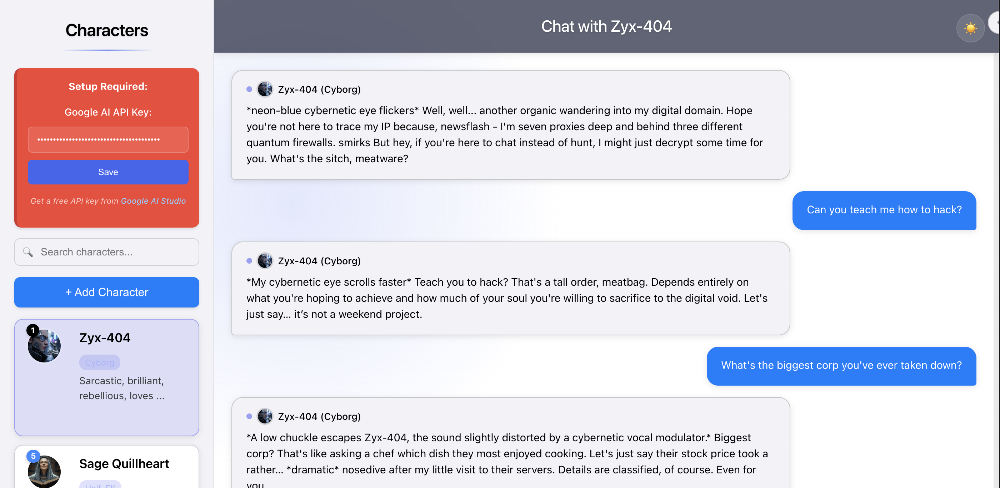
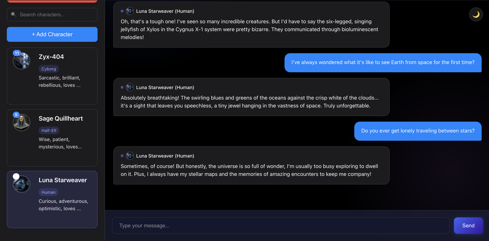

# custom-character-AI-chatbot

A vibe-coded, lightweight, single-file web application for creating and chatting with AI-powered characters. Built with vanilla JavaScript and Google's Gemini AI, this application runs entirely in the browser—no server required.

## Purpose
This repository is a demo and exploration of creating a custom AI character chatbot app. It’s not a template for mass adoption or open-source collaboration—just a public display of what happens when you let vibes (and AI) guide your coding.

> **Not accepting contributions or issues.** If you vibe with it, fork away and make it your own!

## 🚫 No Live Demo
This project does not provide a hosted live demo. Because it requires your own Google AI API key, and to protect user security and privacy, it is designed to run locally in your browser. Simply follow the steps below to get started on your own machine.

## ✨ Features

### 🎨 Theme Support
- **Automatic & Manual**: Follows your system's light/dark mode preference, or toggle manually with the button in the top-right corner.
- **Persistence & Accessibility**: Remembers your theme between sessions, with high contrast and readability in both modes.

- **Single HTML File**: No installation or build process needed—just open and go.
- **Modern UI**: Clean, minimalist sci-fi glassmorphism design.
- **Character Creation**: Create and customize your own AI characters with avatars.
- **Persistent Storage**: Characters and conversations are saved in your browser's localStorage.
- **Responsive Design**: Works on desktop and mobile devices.
- **Offline Capable**: Basic functionality works without an internet connection.
- **Google AI Integration**: Powered by Google's Gemini AI (API key required).
- **Graceful Degradation**: Falls back to simple responses when the API is unavailable.
- **Smooth Animations**: Enjoy fluid transitions and interactions.
- **Message Timestamps**: See when messages were sent with relative time display.
- **Avatar Support**: Upload custom avatars for your characters.
- **No Backend**: Runs entirely client-side with no server required.
- **File Size**: Single HTML file, currently ~100KB.
- **Dependencies**: None (vanilla JavaScript).
- **Browser Support**: Works in all modern browsers (Chrome, Firefox, Safari, Edge).

## 🖼️ Screenshots

| Light Mode | Dark Mode |
|------------|-----------|
|  |  |

## 🚀 Getting Started

1. **Get a Google AI API Key**
   - Go to [Google AI Studio](https://makersuite.google.com/app/apikey) and sign in.
   - Create a new API key and copy it.

2. **Add Your API Key**
   - Open `character-chatbot.html` in your favorite text editor.
   - Search for `key: 'YOUR_GOOGLE_API_KEY_HERE'` (near line 1250).
   - Replace the placeholder with your actual API key and save the file.

3. **Launch the App**
   - Double-click the HTML file or open it in your web browser (no server needed).
   - The app works with the `file://` protocol.
   - If your API key is working, the "Setup Required" notice in the top-right will disappear.

## 🛠️ Usage

### Creating a Character
1. Click the "+ Add Character" button in the sidebar
2. Fill in the character details:
   - **Name**: Your character's name (required)
   - **Species**: Your character's species (e.g., Human, Elf, Robot)
   - **Personality**: Key personality traits (e.g., "Friendly, curious, and adventurous")
   - **Description**: Detailed background, appearance, and characteristics
   - **Greeting**: How the character introduces themselves
   - **Fallback Responses**: Optional alternative responses when AI is unavailable (one per line)
   - **Avatar**: Upload a square image (optional, under 100KB)
3. Click "Create Character"

### Chatting with Characters
1. Select a character from the sidebar
2. Type your message in the input field at the bottom and press Enter or click "Send"
3. The AI will respond in character based on your input
4. The conversation will be saved automatically

### Managing Characters
- **Switch Characters**: Click any character in the sidebar to switch conversations
- **Create New Characters**: Use the "+ Add Character" button to create more characters
- **Character Cards**: Each character is displayed with their avatar (or initials) and key details
- **Conversation History**: Each character maintains their own conversation history

## 🎨 UI/UX Features

- **Glassmorphism Design**: Modern, semi-transparent UI elements with blur effects
- **Responsive Layout**: Works on all screen sizes
- **Smooth Animations**: Subtle transitions for a polished feel
- **Visual Feedback**: Clear indicators for loading states and interactions
- **Dark Theme**: Easy on the eyes for extended use

## 🔧 Technical Details

- **Storage**: All data is saved in the browser's localStorage
- **No Backend**: Runs entirely client-side with no server required
- **File Size**: Single HTML file under 200KB
- **Dependencies**: None (vanilla JavaScript)
- **Browser Support**: Works in all modern browsers (Chrome, Firefox, Safari, Edge)

## 📄 License

This project is open source and available under the [MIT License](LICENSE).